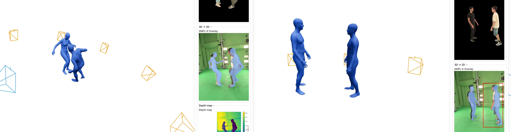
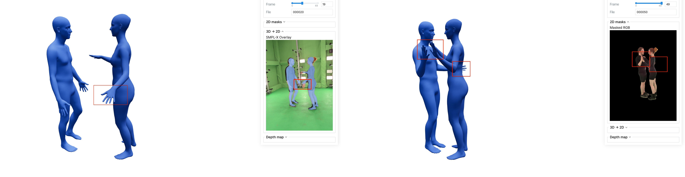
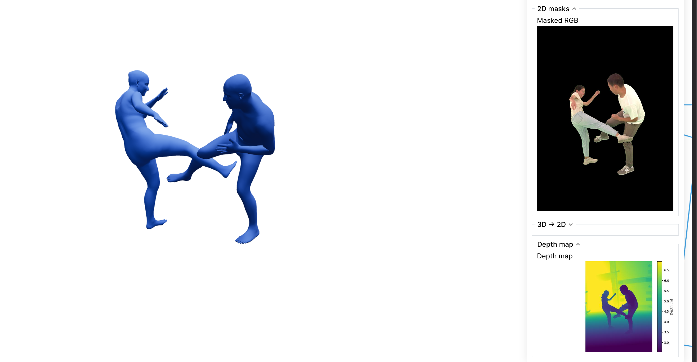
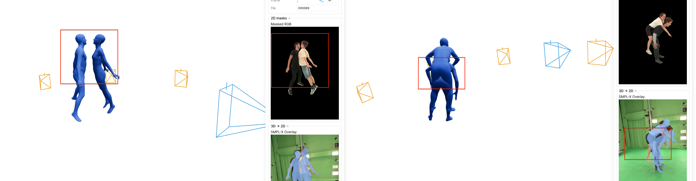
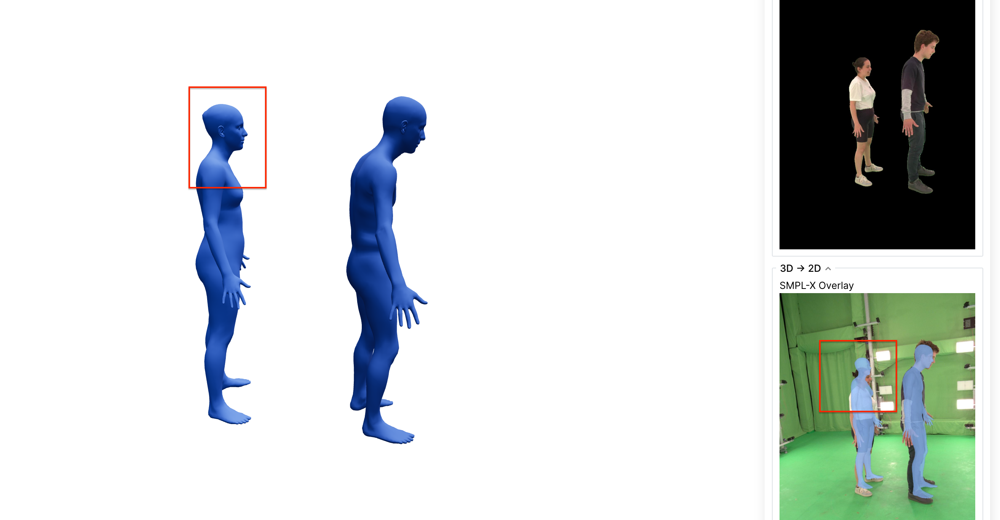

# On Limitations of PromptHMR-Vid 

## Context
This memo summarizes why we switched from Human3R to PromptHMR-Vid and documents both limitations and positive examples on our HI4D scene data.

1. We switched from Human3R ([project page](https://fanegg.github.io/Human3R/)) to PromptHMR-Vid ([project page](https://yufu-wang.github.io/phmr-page/)) to obtain camera and human poses in world coordinates.

2. Human3R is a feed-forward recurrent method that adds a human-specific head to CUT3R for SMPL-X prediction. Its main advantage is end-to-end full-scene reconstruction without a multi-stage pipeline.
PromptHMR follows a different philosophy: a multi-step pipeline with image and video stages. The image model predicts human meshes in camera coordinates from spatial prompts (bbox, masks), semantic prompts (text describing shape), and interaction cues. In practice, we use all of these prompts except text-based body-shape description. The video head then refines parameters temporally with a transformer encoder that processes per-person tokens across frames, together with cues such as bboxes, to output smoother SMPL-X parameters.

3. A key practical reason for switching is easier alignment of tracking and mesh extraction. We refactored PromptHMR-Vid to use SAM3 for tracks and per-person masks, then feed these masks into the image model. This gives direct alignment between extracted masks and SMPL-X poses. In contrast, Human3R performs tracking internally, which required extra alignment between Human3R tracks and SAM3 tracks for downstream optimization that also depends on masks.

4. PromptHMR is explicitly trained to handle inter-human interactions, which is expected to be beneficial in our setting.

## Positive Examples
1. **For easy poses, 2D alignment is good**
   - In simpler poses/interactions, predicted silhouettes align well in image space.
   - This likely goes together with strong mask quality from SAM3.
   - Note: the original upstream code path used SAM2; this pipeline was refactored to use SAM3.

For reference, we also include how Human3R handled the same scene:

## Negative Examples and Limitations

1. [mentioned in the paper] **No explicit face/hand pose estimation in the current flow**
   - Hands are effectively kept at neutral defaults (mean/identity convention, depending on stage).
   - Jaw/eye/facial expression are also set to neutral values in downstream reconstruction.
   - Result: acceptable coarse body motion, but limited hand/face realism and reduced fidelity for fine articulation.

2. [mentioned in the paper] **No explicit interpenetration handling between people**
   - In close-contact interactions, the reconstructed human meshes can intersect physically.
   - This is visible in the example below and indicates missing multi-person collision constraints in the current stack.

3. [not mentioned in the paper] **Global world placement can be inaccurate during interaction**
   - In interaction scenes, people can be globally mis-positioned in world space.
   - Typical failure mode: parts that should be in contact show a visible gap.

For reference, how Human3R handled the world placement of the same scenes:

4. [implicitly mentioned / expected] **Occasional bad shape estimation**
   - Observed only in one scene and only for one of the two humans in that scene.
   - Main failure mode was incorrect body height (while other shape attributes could still look plausible).

